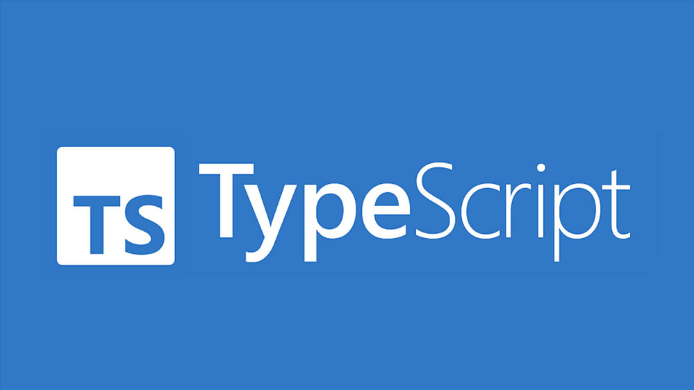

# 🚀 Nome do Projeto

**Descrição breve:** Esse é o meu repositorio para TypeScript.

## 📖 Sobre o Projeto

Este projeto tem o intuito de me aperfeiçoar como programador e tudo será atualizado com o passar do tempo, espero que gostem. 

> _“Viva o seu, sem distrações.”_

---

## 🛠️ Funcionalidades

- ✅ Manipulação TypeScript
- ✅ Totalmente remoto
- ✅ Comitando pelo |GITBASH|
- 🔧 Melhorias futuras

---

## 📸 Screenshots
 

| Tela principal | Tela secundária |
|----------------|----------------|
|  |  |

---

## 🚀 Tecnologias Utilizadas

- **Linguagem 1** - descrição breve (ex: TypeScript)
- **Framework/Biblioteca 1** - descrição breve (ex: Json)
- **Ferramenta/Plataforma 1** - descrição breve (ex: JavaScript)

---

## 📦 Como Instalar

Passo a passo para instalar o projeto localmente.

```bash
# Clone o repositório
git clone https://github.com/seuusuario/Typescript.Functions.git

# Navegue até o diretório do projeto
cd nome-do-repositorio

# Instale as dependências
npm install

# Execute o projeto
npm start

📄 Licença
Este projeto está sob a licença XYZ - consulte o arquivo LICENSE para detalhes.

💬 Contato
Se precisar de ajuda ou tiver dúvidas, entre em contato:

Augusto Santos - linkedin.com/in/augusto-dos-santos-barbosa - augustosantos1709@gmail.com